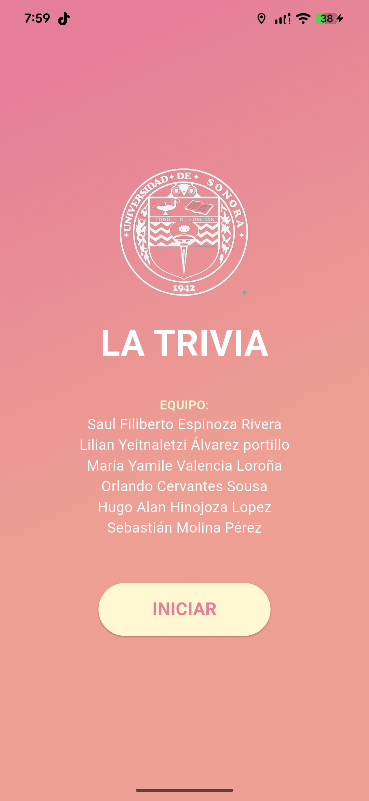
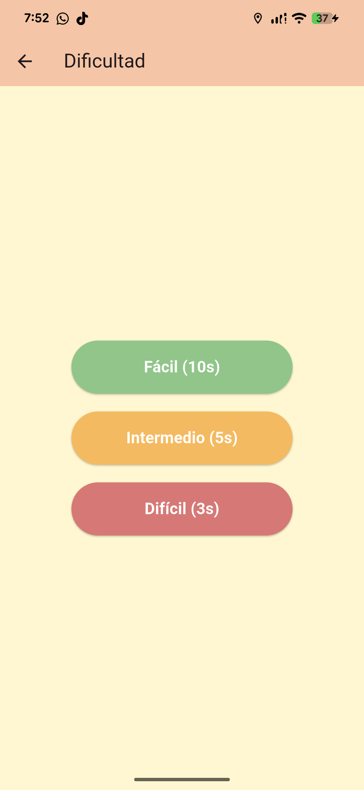
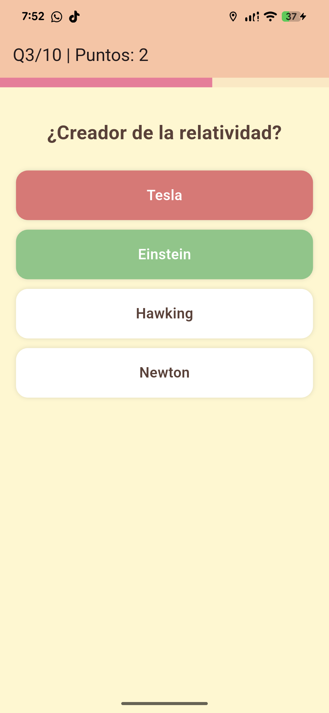
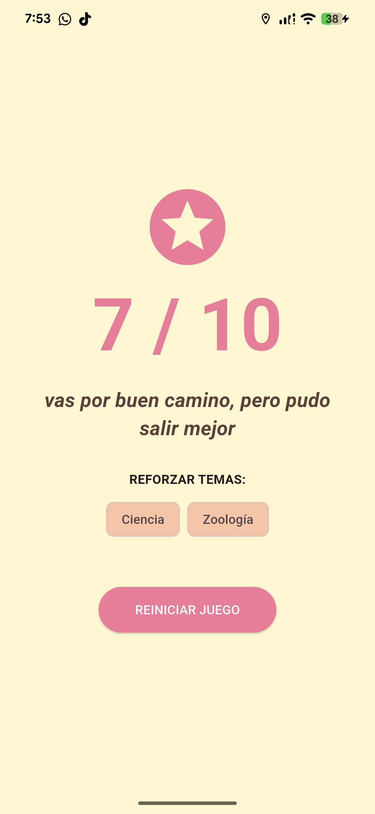

  
  <h1>🦉 Desafío Búho: La Trivia Unison</h1>
  
<strong>Proyecto - Ingeniería en Sistemas de Información</strong>

  
  
  

---

### 📝 Descripción
**Desafío Búho** es una aplicación móvil de trivia diseñada para poner a prueba los conocimientos generales de los estudiantes. Cuenta con un banco de 30 preguntas aleatorias, gestión de tiempos por dificultad y una arquitectura robusta que separa la lógica de negocio de la interfaz de usuario.

### 🚀 Características Principales
* **Banco Dinámico:** Selección de 10 preguntas al azar de un pool de 30, asegurando que cada partida sea única.
* **Tres Niveles de Dificultad:** * 🟢 **Fácil:** 10 segundos por pregunta.
    * 🟡 **Intermedio:** 5 segundos por pregunta.
    * 🔴 **Difícil:** 3 segundos por pregunta.
* **Feedback Visual:** Animaciones de estado (Verde para correcto, Rojo para incorrecto).
* **Resumen Inteligente:** Identifica los temas que el usuario debe reforzar y entrega mensajes personalizados basados en el desempeño.

---

### 🛠️ Tecnologías Utilizadas

| Tecnología | Versión | Descripción |
| :--- | :--- | :--- |
| **Flutter SDK** | `^3.11.0` | Framework de Google para desarrollo multiplataforma. |
| **Dart** | `^3.11.0` | Lenguaje de programación optimizado para UI. |
| **Material 3** | Nativo | Sistema de diseño de última generación para interfaces fluidas. |

---

### 📸 Galería de la Aplicación

<table align="center">
  <tr>
    <td align="center"><strong>Inicio</strong></td>
    <td align="center"><strong>Dificultad</strong></td>
    <td align="center"><strong>Juego</strong></td>
    <td align="center"><strong>Resultados</strong></td>
  </tr>
  <tr>
    <td></td>
    <td></td>
    <td></td>
    <td></td>
  </tr>
</table>

---

### Créditos del Equipo
Este proyecto fue desarrollado por:
* Saul Filiberto Espinoza Rivera
* Lilian Yeitnaletzi Álvarez portillo
* María Yamile Valencia Loroña
* Orlando Cervantes Sousa
* Hugo Alan Hinojoza Lopez
* Sebastián Molina Pérez

---

### 📦 Release 1.0
Puedes descargar el instalador directo para Android aquí:
 

