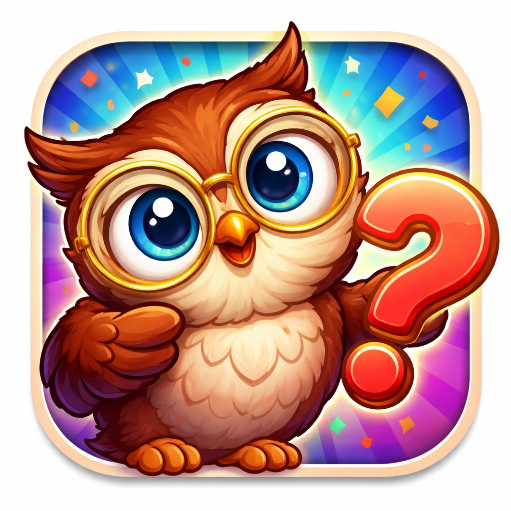

  
  <h1>La Trivia Unison</h1>
  
<strong>Proyecto - Ingeniería en Sistemas de Información</strong>

  
  
  

---

###  Descripción
**La Trivia** es una aplicación móvil de trivia diseñada con 30 preguntas de cultura general, las cuales se seleccionan al azar y estas serán al azar en cada partida que el usuario inicie. Contamos con 3 dificultades y un Easter Egg en caso de que logres responder las 10/10 preguntas en el modo difícil. Al iniciar el juego se mostrará una pregunta y 4 respuestas posibles, de las cuales una sola es correcta; en caso de que no se responda o no se sepa la pregunta, el juego le dirá la correcta y esta no contará en tu puntuación.

###  Características Principales
* **Banco Dinámico:** Selección de 10 preguntas al azar de un pool de 30, asegurando que cada partida sea única.
* **Tres Niveles de Dificultad:** 
    * 🟢 **Fácil:** 10 segundos por pregunta.
    * 🟡 **Intermedio:** 5 segundos por pregunta.
    * 🔴 **Difícil:** 3 segundos por pregunta.
* **Feedback Visual:** Animaciones de estado (Verde para correcto, Rojo para incorrecto).
* **Resumen Inteligente:** Identifica los temas que el usuario debe reforzar y entrega mensajes personalizados basados en el desempeño.

---

###  Tecnologías Utilizadas

| Tecnología | Versión | Descripción |
| :--- | :--- | :--- |
| **Flutter SDK** | `^3.11.0` | Framework de Google para desarrollo multiplataforma. |
| **Dart** | `^3.11.0` | Lenguaje de programación optimizado para UI. |
| **Material 3** | Nativo | Sistema de diseño de última generación para interfaces fluidas. |

---

###  Paleta de Colores Seleccionada
Se utilizó una paleta de tonos pasteles cálidos para garantizar una interfaz amigable y de alta legibilidad, inspirada en [ColorHunt](https://colorhunt.co/palette/fff7cdfdc3a1fb9b8ff57799).

| Tono | Hex | Aplicación |
| :--- | :--- | :--- |
|  | `#FFF7CD` | **Fondo:** Color base para descanso visual. |
|  | `#FDC3A1` | **Acentos:** Detalles en AppBar y selección. |
|  | `#FB9B8F` | **Secundario:** Botones de opciones y chips. |
|  | `#F57799` | **Primario:** Títulos y barra de progreso. |

---

###  Galería de la Aplicación

<table align="center">
  <tr>
    <td align="center"><strong>Inicio</strong></td>
    <td align="center"><strong>Dificultad</strong></td>
    <td align="center"><strong>Juego</strong></td>
    <td align="center"><strong>Resultados</strong></td>
  </tr>
  <tr>
    <td></td>
    <td></td>
    <td></td>
    <td></td>
  </tr>
</table>

---

### Créditos del Equipo
Este proyecto fue desarrollado por:
* Saul Filiberto Espinoza Rivera
* Lilian Yeitnaletzi Álvarez portillo
* María Yamile Valencia Loroña
* Orlando Cervantes Sousa
* Hugo Alan Hinojoza Lopez
* Sebastián Molina Pérez

---

###  Release 1.0
Puedes descargar el instalador directo para Android aquí:

