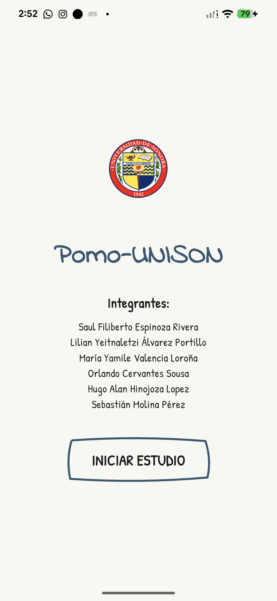
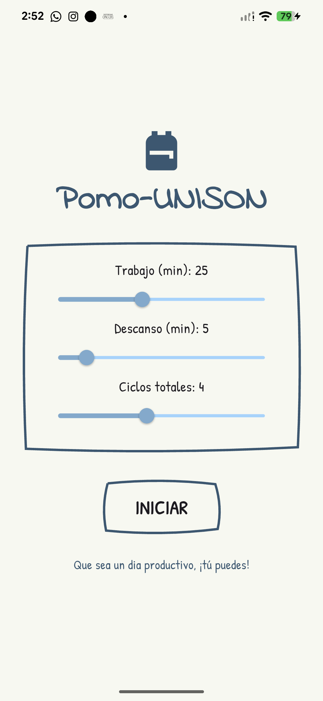
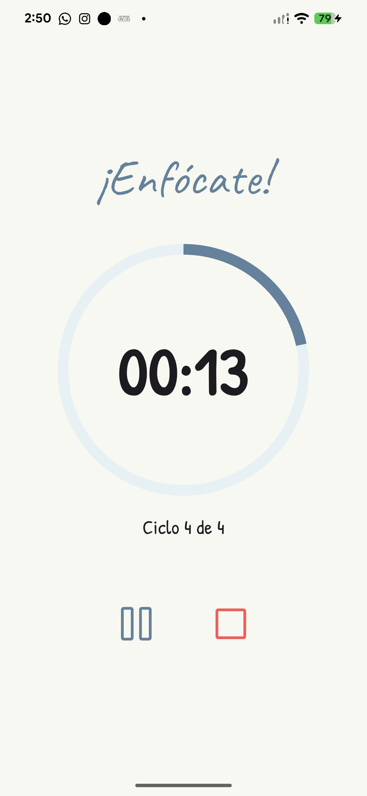
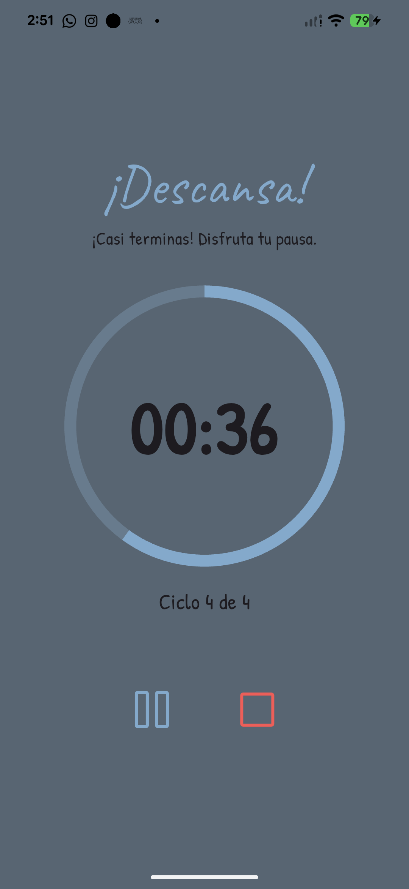
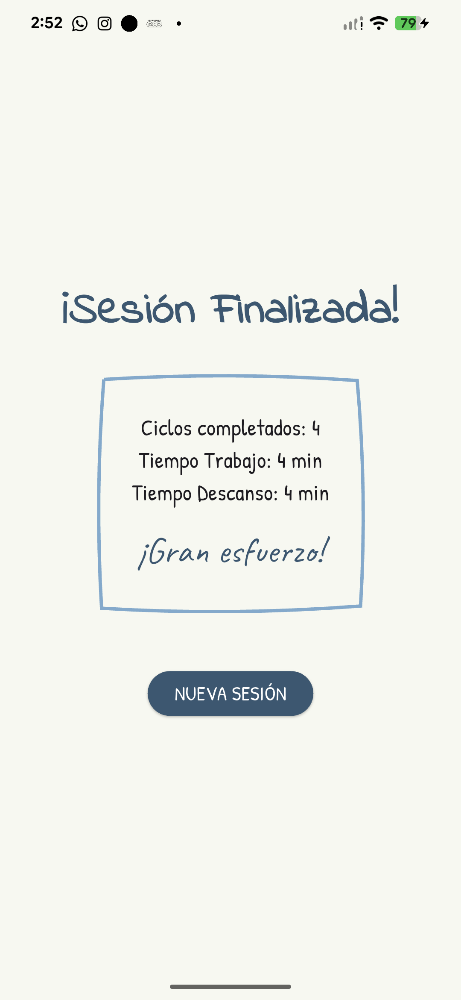

# 📚 Pomo-UNISON
### *Productividad con un toque artesanal*

---

## 📖 Descripción de la Aplicación

<b>Pomo-UNISON</b> es una aplicación desarrollada en <b>Flutter</b> que implementa la técnica de productividad <b>Pomodoro</b>.  
Su interfaz utiliza un estilo visual <i>hand-drawn</i> que busca transmitir una sensación cálida y artesanal, combinando una experiencia visual amigable con una estructura técnica clara.

La aplicación permite gestionar ciclos de estudio y descanso de forma automática, ayudando a los estudiantes a mantener la concentración y mejorar su rendimiento académico.

---

## ✨ Características Principales

- ⚙ **Configuración Flexible**  
  Ajuste de bloques de trabajo (1-60 min), descansos (1-30 min) y número de ciclos (1-8).

- 🧠 **Lógica Desacoplada**  
  Manejo del estado mediante **Provider**, separando la lógica del temporizador de la interfaz gráfica.

- 🔄 **Transiciones Automáticas**  
  Cambios automáticos entre **modo trabajo** y **modo descanso**.

- 📊 **Resumen de Sesión**  
  Estadísticas del tiempo de estudio y descanso al finalizar la sesión.

- 💬 **Mensajes Motivacionales**  
  Durante los descansos se muestran mensajes aleatorios para incentivar la productividad.

---

## ⚙ Tecnologías y Librerías

<table>
<tr>
<td align="center"><b>Tecnología</b></td>
<td align="center"><b>Uso</b></td>
<td align="center"><b>Versión</b></td>
</tr>

<tr>
<td><b>Flutter</b></td>
<td>Framework para desarrollo de aplicaciones multiplataforma</td>
<td>3.x</td>
</tr>

<tr>
<td><b>Dart</b></td>
<td>Lenguaje de programación principal</td>
<td>3.x</td>
</tr>

<tr>
<td><b>Provider</b></td>
<td>Gestión del estado de la aplicación</td>
<td>^6.1.2</td>
</tr>

<tr>
<td><b>Google Fonts</b></td>
<td>Fuentes manuscritas (Patrick Hand, Indie Flower)</td>
<td>^6.2.1</td>
</tr>

<tr>
<td><b>Phosphor Icons</b></td>
<td>Iconografía estilo boceto</td>
<td>^2.1.0</td>
</tr>

<tr>
<td><b>Dart Math</b></td>
<td>Generación de mensajes motivacionales aleatorios</td>
<td>N/A</td>
</tr>

</table>

---

## 📸 Galería de la Aplicación

<i>Paleta basada en ColorHunt</i>  
<b>#355872 | #7AAACE | #9CD5FF | #F7F8F0</b>

 

<table>
<tr>
<td align="center">
 
Inicio
</td>

<td align="center">
 
Configuración
</td>

<td align="center">
 
Temporizador
</td>
</tr>

<tr>
<td align="center">
 
Modo Descanso
</td>

<td align="center">
 
Resumen
</td>
</tr>
</table>

 

## 📦 Descargar Aplicación

---

## 👨‍💻 Equipo de Desarrollo  
**Universidad de Sonora — Programación de Sistemas III**

 

**Saúl Filiberto Espinoza Rivera**  
Lilian Yeitnaletzi Álvarez Portillo  
María Yamile Valencia Loroña  

Orlando Cervantes Sousa  
Hugo Alan Hinojoza Lopez  
Sebastián Molina Pérez

