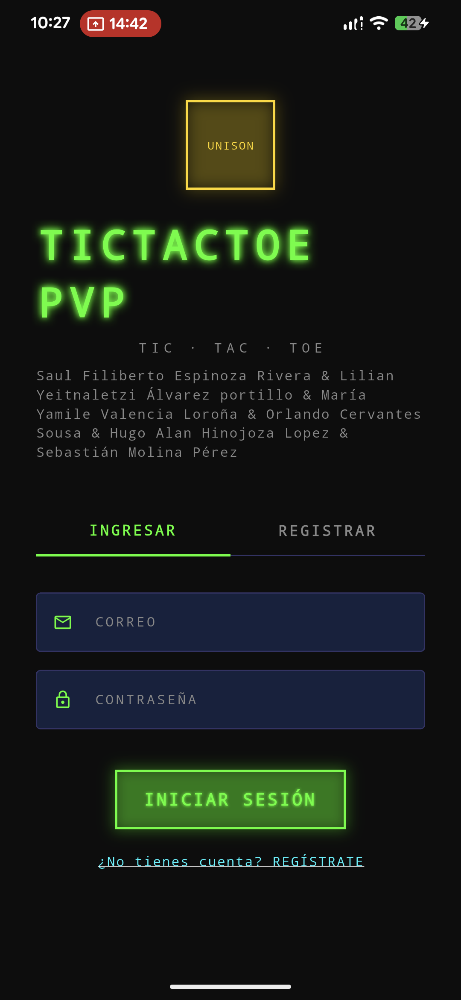
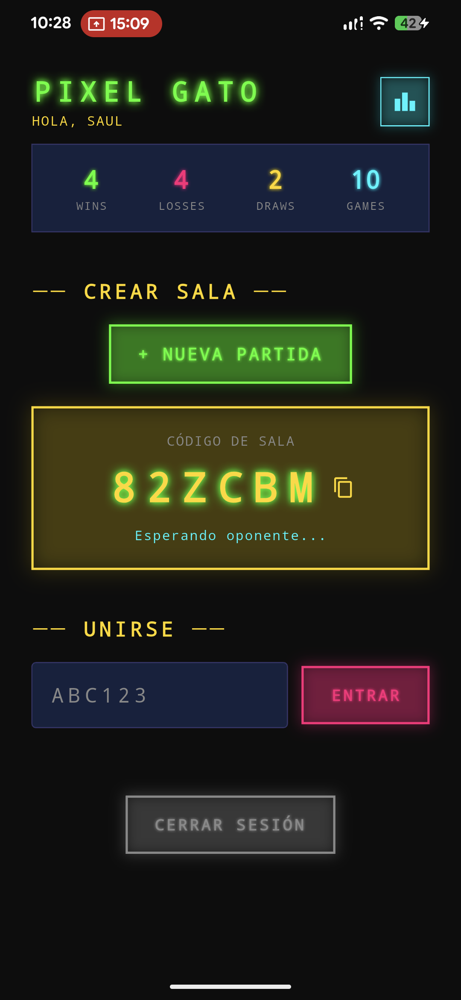
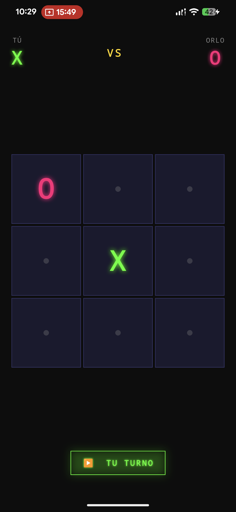

# <div align="center">👾 TIC TAC TOE PVP </div>
### <div align="center">🕹️ TIC · TAC · TOE — MULTIPLAYER </div>

<div align="center">

[](#)
[](https://flutter.dev)
[](https://firebase.google.com)
[](#)

**Juego del Gato multijugador en tiempo real desarrollado con Flutter y Firebase.**
*Autenticación, sincronización instantánea entre dispositivos, ranking global y una estética retro-terminal.*

[⬇ DESCARGAR APK v1.0.0](https://github.com/OrlandoCvs/FLUTTER/raw/main/tictactoepvp/release/tictactoepvp.apk)
</div>

---

## 📱 01 — VISTAS DE LA APP

<div align="center">

| LOGIN / REGISTRO | LOBBY / SALA | PARTIDA EN VIVO |
| :---: | :---: | :---: |
|  |  |  |
| *🔐 Autenticación* | *🏠 Sala de espera* | *🎮 Gameplay Real* |

</div>

---

##  02 — FUNCIONALIDADES

* **Tiempo Real:** Sincronización instantánea mediante Firestore Listeners para cada movimiento.
* **Salas con Código:** Crea una sala y comparte el código de 6 caracteres con tu oponente.
* **historial de Movimientos:** Registro detallado de cada jugada (fila, columna y símbolo).
* **Ranking Global:** Dashboard con el Top 10 de jugadores basado en victorias totales.
* **Efectos de Sonido:** Audio retro de 8-bits para clics, victorias, derrotas y empates.
* **Animaciones:** Símbolos elásticos (X/O) y resaltado visual de la línea ganadora.
* **Estética Retro CRT:** Paleta neón (Verde/Magenta) sobre fondo oscuro tipo terminal.

---

##  03 — STACK TECNOLÓGICO

- **Framework:** **Flutter v3.41.2** (Channel Stable)
- **Backend:** **Firebase Auth** (Gestión de usuarios) & **Cloud Firestore** (Base de datos NoSQL)
- **Audio:** `audioplayers ^6.1.0`
- **Animaciones:** `flutter_animate ^4.5.0` & `Lottie ^3.1.2`
- **Utilidades:** `uuid ^4.5.1` & `google_fonts ^6.2.1`

---

##  04 — ESTRUCTURA FIRESTORE

| Colección | Propósito | Campos Clave |
| :--- | :--- | :--- |
| **`users/{uid}`** | Perfiles | `username`, `email`, `wins`, `losses`, `totalGames` |
| **`games/{id}`** | Partidas activas | `roomCode`, `board[]`, `currentTurn`, `status`, `winnerId` |
| **`moves`** | Registro (embebido) | `playerId`, `playerSymbol`, `row`, `col`, `moveNumber` |

---

##  05 — INSTALACIÓN Y EJECUCIÓN

1.  **Clonar el repositorio:**
    ```bash
    git clone [https://github.com/OrlandoCvs/FLUTTER.git](https://github.com/OrlandoCvs/FLUTTER.git)
    cd FLUTTER
    ```

2.  **Instalar dependencias:**
    ```bash
    flutter pub get
    ```

3.  **Configurar Firebase:**
    Asegúrate de colocar tu archivo `google-services.json` en la ruta `android/app/`.

4.  **Ejecutar el proyecto:**
    ```bash
    # Para dispositivo físico o emulador
    flutter run

    # Para generar el instalador
    flutter build apk --release
    ```

---

##  06 — EQUIPO DE DESARROLLO

<div align="center">

**[Saul Filiberto Espinoza Rivera]** | **[Orlando Cervantes Sousa]** | **Sebastian Molina Perez** | **[Lilian Yeitnaletzi Álvarez portillo]** | **[María Yamile Valencia Loroña]** | **[Hugo Alan Hinojoza Lopez]**

Desarrollado para la materia de **Programación de Sistemas III**
**Universidad de Sonora** · Hermosillo, Sonora · 2026

---

**tic tac toe pvp — UNISON 2026**
[REPOSITORIO](#) • [DESCARGAR APK](https://github.com/OrlandoCvs/FLUTTER/raw/main/tictactoepvp/release/tictactoepvp.apk) • [FIREBASE](https://console.firebase.google.com)
</div>